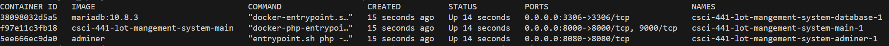

# CSCI-441-LoT-MANGEMENT-SYSTEM

LoT MANGEMENT SYSTEM

Hello, 

Laravel is has a bit more config out of the box than some other frameworks so I packaged up some the initial configuration settings and required software into docker containers. For simplicity, all the modules will get downloaded with the repo when cloned off of github.

The application needed to run this on a windows/mac/linux OS is called docker desktop.

https://www.docker.com/products/docker-desktop/

Installing Docker Desktop

There may be some pitfalls you run into when trying to install this on your machine. 

1. Make sure Windows Subsystem Linux is updated.

    If you are using windows 10, you may need to download Windows Subsystem for Linux from the microsoft store. Docker is a VM platform and uses WSL as it's hypervisor. 

After downloading from the above link and installing on your machine. you can navigate you the root directory of project in the command line and run 

`docker compose up`

This will build the mariadb database, the DB viewer, and the main application and run them on your local machine that should accessible from

adminer (DB viewer) : localhost:8080 or 127.0.0.1:8080
main application : localhost:8000 or 127.0.0.1:8000

The containers should be shown as running in the docker desktop container

After Docker successfully builds the containers, we need to add our test data. in the command prompt type:

`docker ps`

This will list out the containers and their id's

To do the migration, we will need to run 

`docker exec -it [containerid] php artisan migrate:fresh --seed`

using the CONTAINER ID from the "csci-441-lot-mangement-system-main" image in the above list

It will likely ask you this 

type yes and continue

to log in to the database viewer you will need to input the below information where the password is "root"

I am still working on getting it set up to hot reload when changes are made as it currently only shows changes when reloading the page. In the next couple of days I will add more documentation about blade and our plans with integrating it into our backend.

